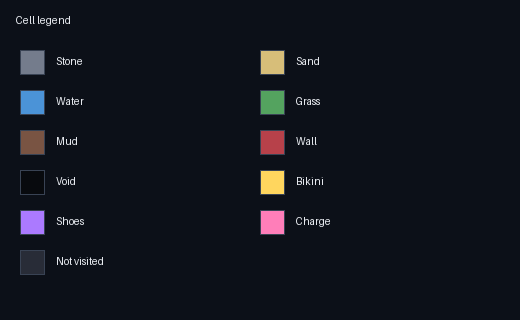
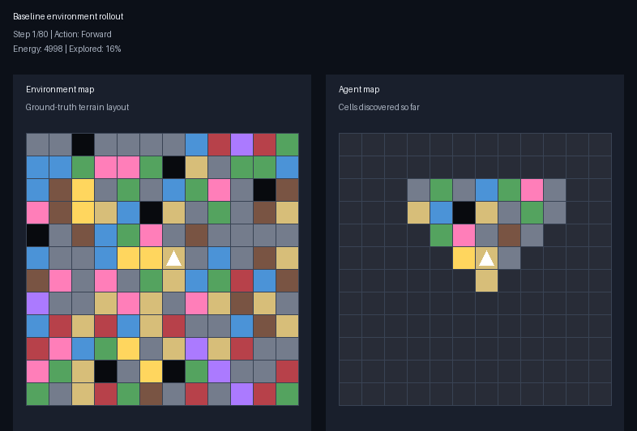
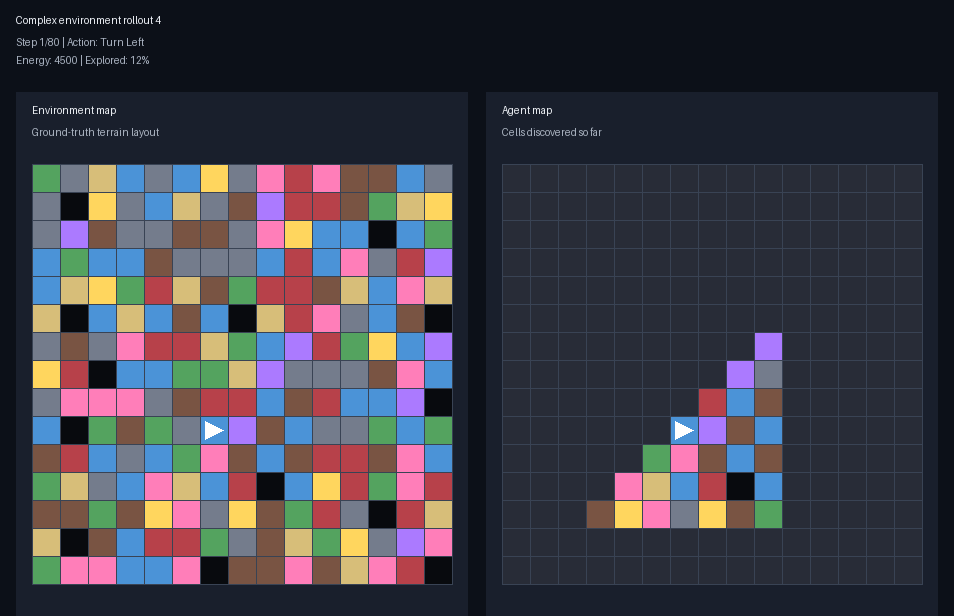

# A-POET

<table>
  <tr>
    <td valign="top" width="50%">
      
A-POET is an implementation of an adaptation of Paired Open-Ended Trailblazer (POET) to our own environments and agents. As it is a base for our thesis, we have changed some algorithms and methods that the original and enhanced POET used, in order to build a simpler but useful project from which to develop our thesis.

      
The simulations below show agents taking random actions in two different environments: the original rollout and a more complex map.

    </td>
    <td valign="top" width="50%">
      
    </td>
  </tr>
</table>

## Random-Action Simulations

   
  

